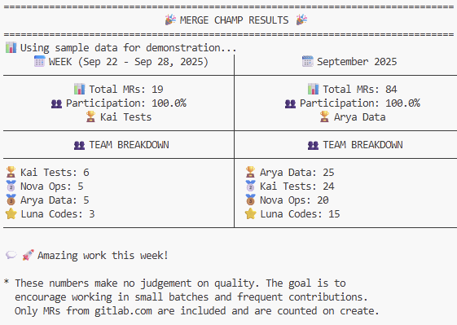

# Merge Champ 🏆

Get Merge Request stats from Gitlab right from your Terminal. And publish to MS Teams.



Note: This project was fully vibe-coded with Github Co-Pilot. And manually retested.

## Setup

```bash
pip install -r requirements.txt
cp .env.example .env  # edit with your GitLab token, group/project, and team members
```

## Run it

| Scenario | Command |
| --- | --- |
| Example full call | `python main-py --month 2025-08 --weighted --publish-teams`|
| Demo with fake data | `python main.py --sample` |
| Live stats (raw counts) | `python main.py` |
| Live stats (weighted) | `python main.py --weighted` |
| Exact week | `python main.py --week 2025-09-01` |
| Exact month | `python main.py --month 2025-09` |
| Look back month (e.g. last month) | `python main.py --month-offset 1` |
| Look back week (0 for this week) | `python main.py --week-offset 0` |
| Export to Teams | `python main.py --publish-teams` |
| Inspect Teams payload only | `python main.py --publish-teams-debug` |


## Configuration

```env
# GitLab Configuration
GITLAB_TOKEN=your_gitlab_token_here
GITLAB_URL=https://gitlab.com

# GitLab Data Source Options (choose one):
# Option 1: Specific project
PROJECT_ID=your_project_id_here
# Option 2: All projects in a group (recommended for teams)
GROUP_ID=your_group_id_here

# Team Members (comma-separated usernames)
TEAM_MEMBERS=john.doe,jane.smith,alice.johnson,bob.wilson

# Output Configuration (optional)
OUTPUT_DIR=output

# Notification Configuration (optional)
MS_TEAMS_WEBHOOK_URL=
ENABLE_TEAMS_NOTIFICATIONS=true

# Merge Request Counting (optional)
MR_WEIGHT_RULES=20:0.3,80:0.6,200:1.0
```
